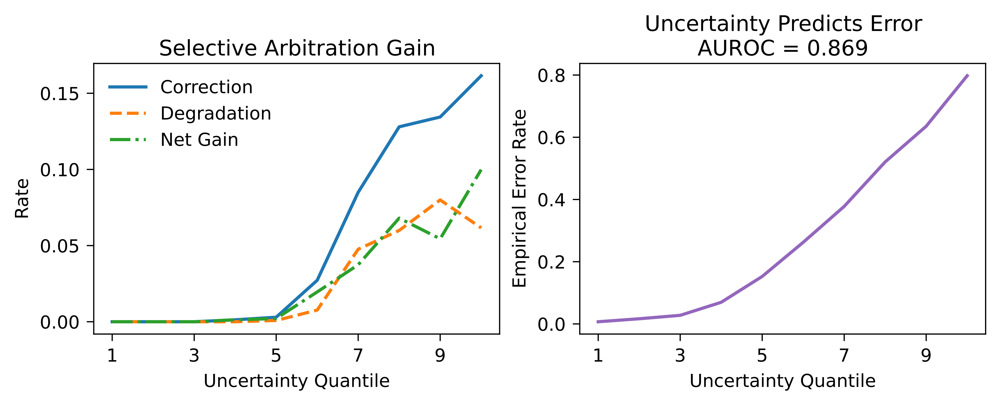
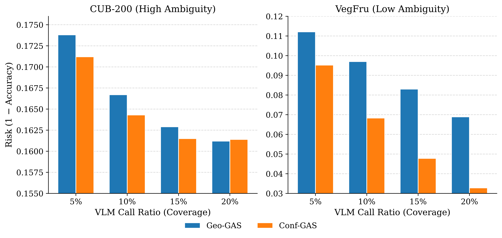
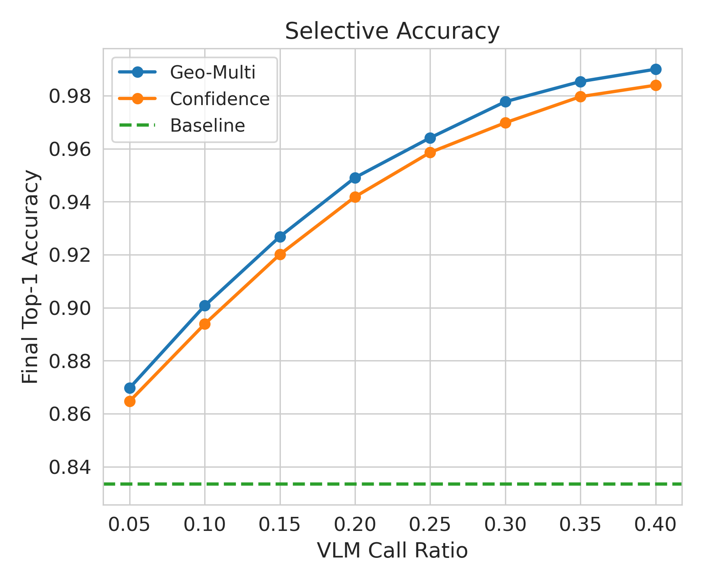
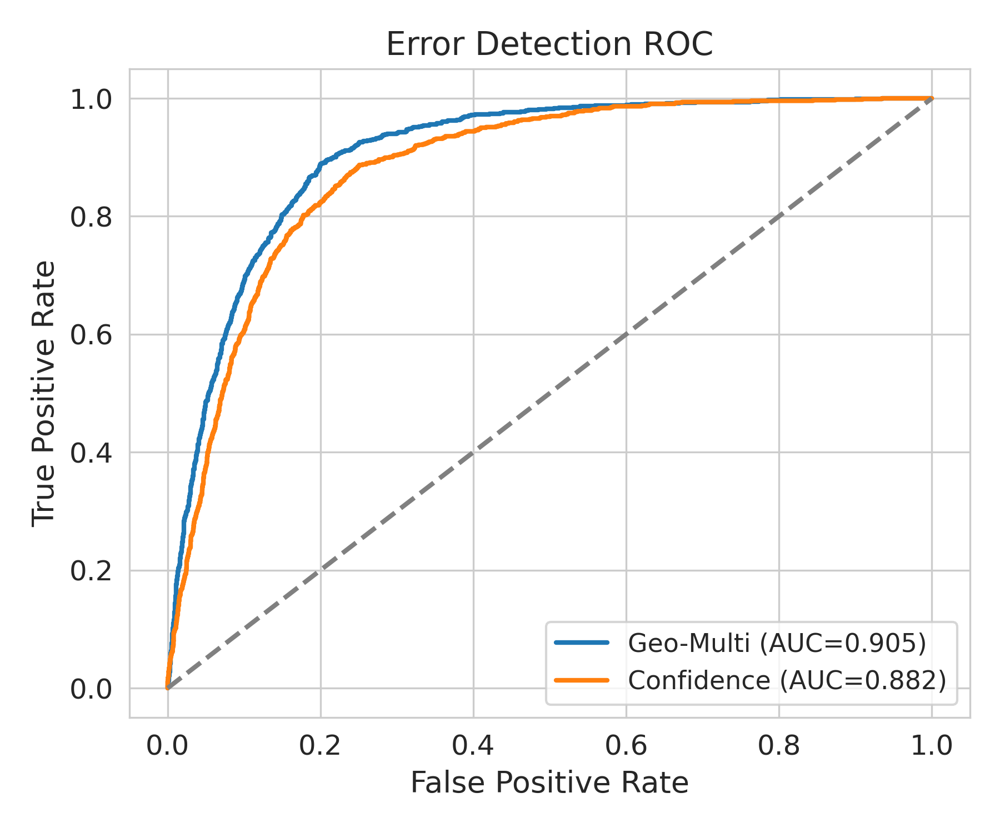
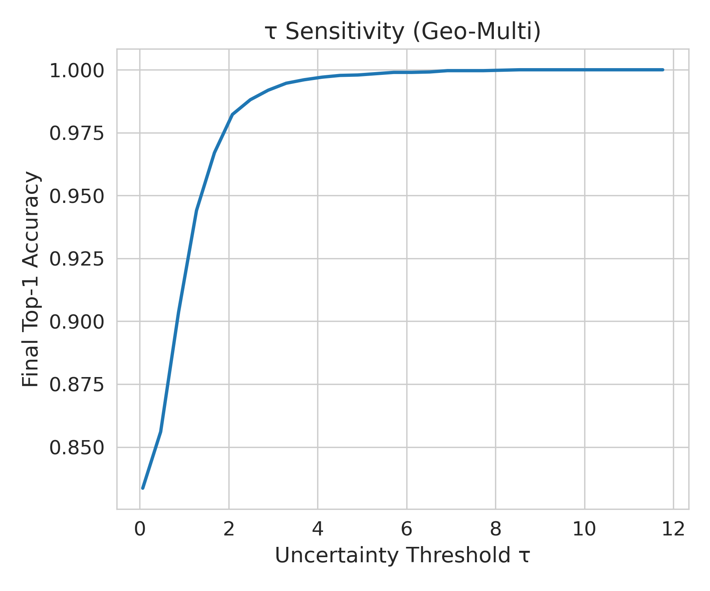

# GAS-NeurIPS2026

# Geometry-Aware Uncertainty and Structured Vision-Language Arbitration for Fine-Grained Fruit Recognition

**NeurIPS 2026 Submission** | Anonymous Preprint

<p align="center">
  
</p>

---

## ✨ Highlights

- 提出 **Geometry-Aware Structured Arbitration (GAS)** 框架，有效解决细粒度识别中的边界模糊与系统性过自信问题。
- 在 **representation-level** 建模几何不确定性（geometric uncertainty），优于传统 softmax confidence。
- 设计 **候选受限、上下文感知** 的选择性 VLM 仲裁机制，仅在高不确定性样本上触发，有效降低幻觉。
- 构建 **Fruit-306** 大规模细粒度水果数据集（306 类，116,233 张图像）。
- 在高模糊场景下显著提升准确率与可靠性，并在多个细粒度数据集上验证了方法的 regime-adaptive 特性。

---

## 📖 Motivation

<p align="center">
  
</p>

细粒度水果识别中，类别间高度视觉相似性导致特征流形重叠、决策边界模糊，进而引发系统性过自信与不可靠预测。

---

## 🧠 Proposed Method: GAS

<p align="center">
  
</p>

**Geometry-Aware Structured Arbitration (GAS)** 包含四个核心阶段：

1. 异构视觉特征提取（DenseNet201 + EfficientNet-B7 + ViT-B/16）
2. 超球面原型精炼（Hyperspherical Prototype Refinement）
3. 几何感知不确定性估计（Geometric Margin + Calibrated Uncertainty）
4. 结构化选择性 VLM 仲裁（仅在高不确定性样本上触发，受限候选集 + Context-Aware Prompt）

---

## 📊 Main Results on Fruit-306

| Method                    | Top-1   | Top-3   | Top-5   | ECE↓   |
|---------------------------|---------|---------|---------|--------|
| Best Single Backbone      | 71.35% | 86.35% | 89.94% | 11.3% |
| Refined Ensemble          | 72.60% | 87.02% | 90.52% | 10.1% |
| **GAS (Ours)**            | **74.16%** | **88.59%** | **91.72%** | **9.2%** |

- **提升**：+2.81% Top-1, +2.24% Top-3, +1.78% Top-5
- 在高不确定性样本上实现 1271 次纠正，仅引入 606 次退化

更多结果（包括 regime-dependent 分析、AUROC、消融实验等）请参考论文。

---

## 📈 Visualization Results

**Uncertainty Ranking & Selective Arbitration**

<p align="center">
  
</p>

**Regime-dependent Behavior**

<p align="center">
  
</p>

**Additional Analysis**

<p align="center">
  
  
</p>

<p align="center">
  
</p>

---

## 🛠 Installation

```bash
# 1. 创建环境
conda env create -f environment.yml
conda activate gas-neurips2026

# 2. 下载 Fruit-306 数据集
# 请参考: https://mybkgjvgnd.github.io/Fruit-306-Dataset/
